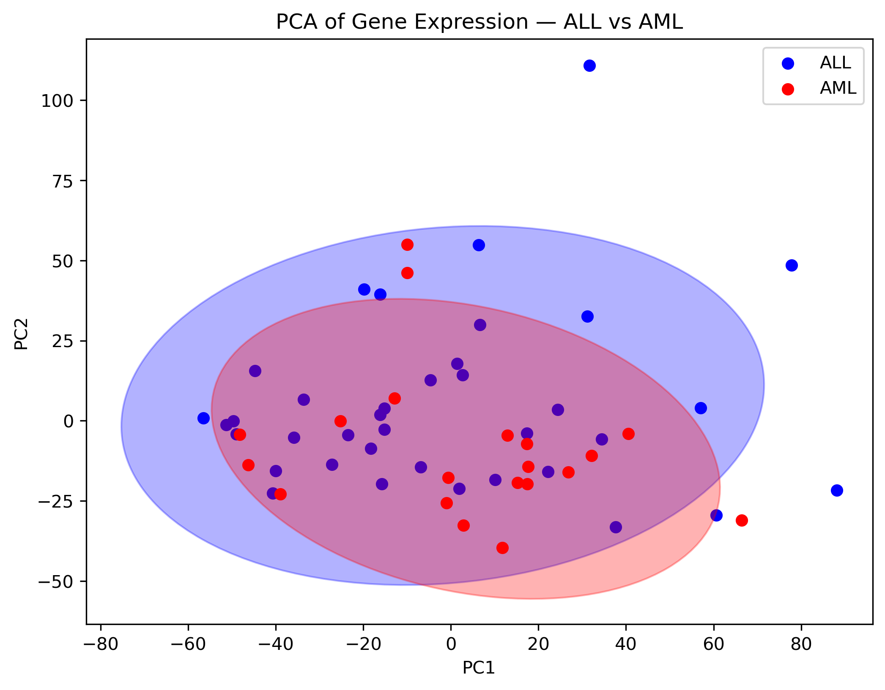
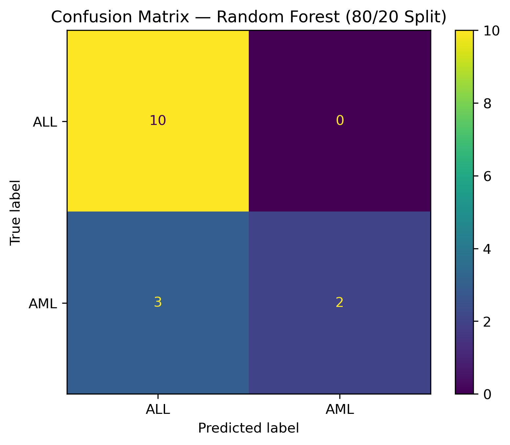
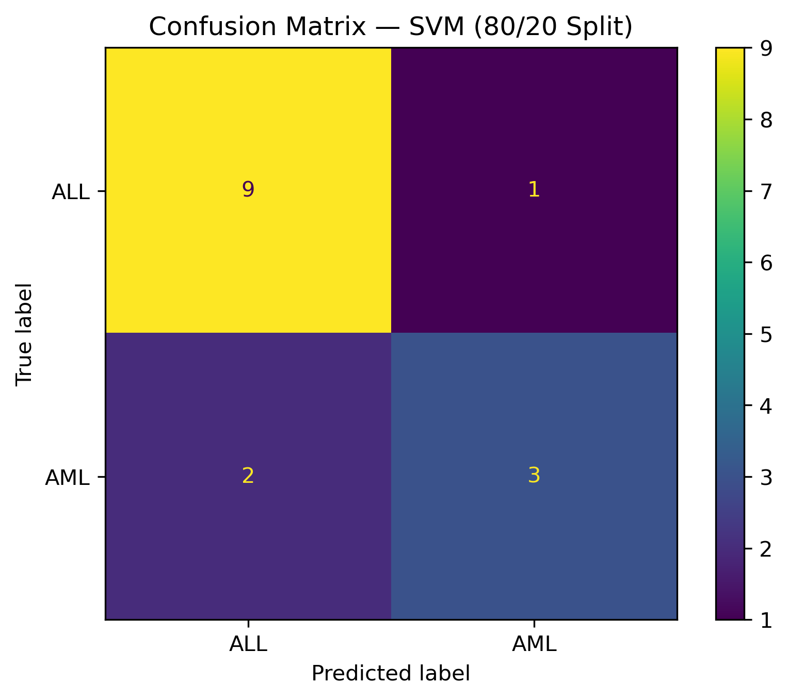
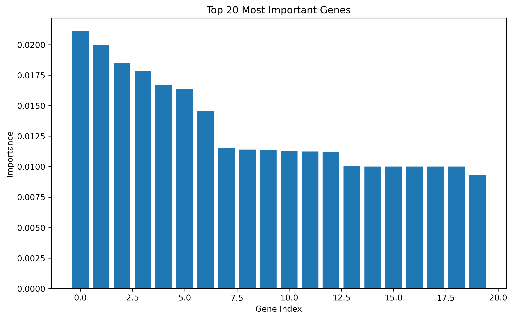

# AML & ALL Classification via Gene Expression
### Machine Learning Mini-Project

  
  &nbsp;
  

---

---

## Overview

Replication of Golub et al. (1999) — one of the most cited papers in computational biology — which demonstrated that gene expression profiling alone could classify leukaemia subtypes. This project applies modern Python tools to the same dataset to classify patients as ALL or AML.

**Research Question:** Can gene expression profiling alone accurately classify leukaemia patients into ALL or AML subtypes, and which genes are most informative for distinguishing between them?

---

## Results

### PCA — Unsupervised Analysis

### Classification — Random Forest & SVM (80/20 Split)

 

### Feature Importance — Most Informative Genes

Both models achieved **80% accuracy**, closely replicating the original paper's 85%.

---

## Dataset

- **Source:** [Golub et al. (1999) — Kaggle](https://www.kaggle.com/datasets/crawford/gene-expression)
- **Samples:** 72 patients, 7,071 genes (after AFFX control probe removal)
- **Split:** 80/20 stratified — 57 training, 15 test

---

## Usage

1. Set up Kaggle API credentials (`~/.kaggle/kaggle.json`)
2. Install dependencies: `pip install -r requirements.txt`
3. Run: `jupyter notebook project.ipynb`

---

## References

- Golub, T.R. et al. (1999). *Molecular Classification of Cancer.* Science, 286(5439), 531–537.
- Crawford, J. (2017). *Gene Expression Dataset.* Kaggle.
